# The Open Source Audit: Capstone Project

This repository contains the shell scripting deliverables for "The Open Source Audit" capstone project for the Open Source Software (OSS) NGMC Course. 

## 👨‍🎓 Student Information
* **Name:*Savni Agrawal* 
* **Registration :** [24BCE10291]
* **University:** VIT Bhopal University
* **Course:** Open Source Software(CSE0002)

## 🛠️ Software Audited
**MySQL** (Community Server)
* **Category:** Relational Database Management System (RDBMS)
* **Primary License:** GNU General Public License v2 (GPLv2)

---

## 💻 Dependencies & Environment Setup
To execute these scripts, the following environment is required:
* A Debian-based Linux environment (Tested on Ubuntu via Windows Subsystem for Linux - WSL).
* **MySQL Server:** Must be installed to fully test Script 2 and Script 3.
  * Install via: `sudo apt update && sudo apt install mysql-server`
* Standard Linux utilities: `bash`, `awk`, `grep`, `dpkg`, `apt-cache`.

---

## 📜 Shell Scripts Overview

This repository contains five Bash scripts demonstrating practical Linux administration, automation, and system auditing concepts.

### 1. System Identity Report (`script1.sh`)
* **Description:** A welcome script that gathers and displays core system information, including the active user, OS distribution, kernel version, current uptime, and the overarching open-source license of the operating system.
* **Concepts Used:** Variables, command substitution (`$()`), and output formatting.
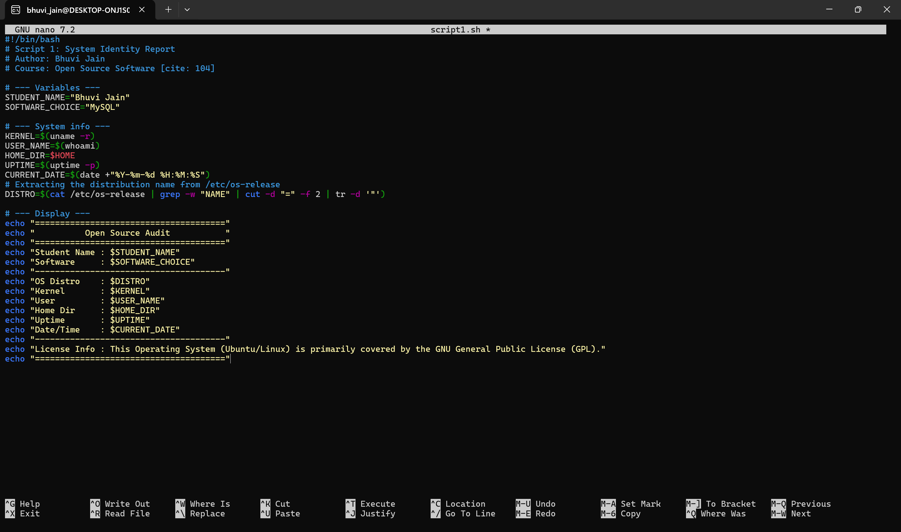
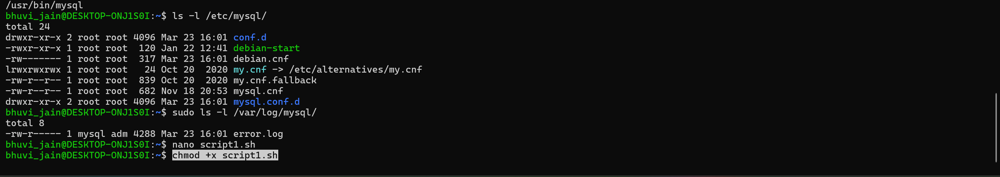
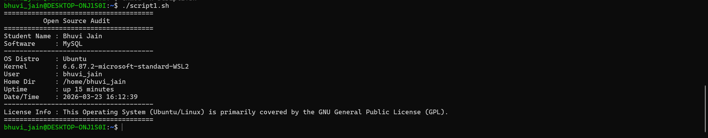

### 2. FOSS Package Inspector (`script2.sh`)
* **Description:** Audits the local system to check if the target software (`mysql-server`) is installed. It retrieves the installed version details using Debian package managers and outputs a philosophical summary of the software.
* **Concepts Used:** `if-then-else` conditionals, `case` statements, `dpkg`, and output piping.
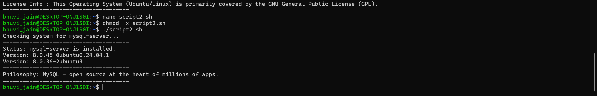
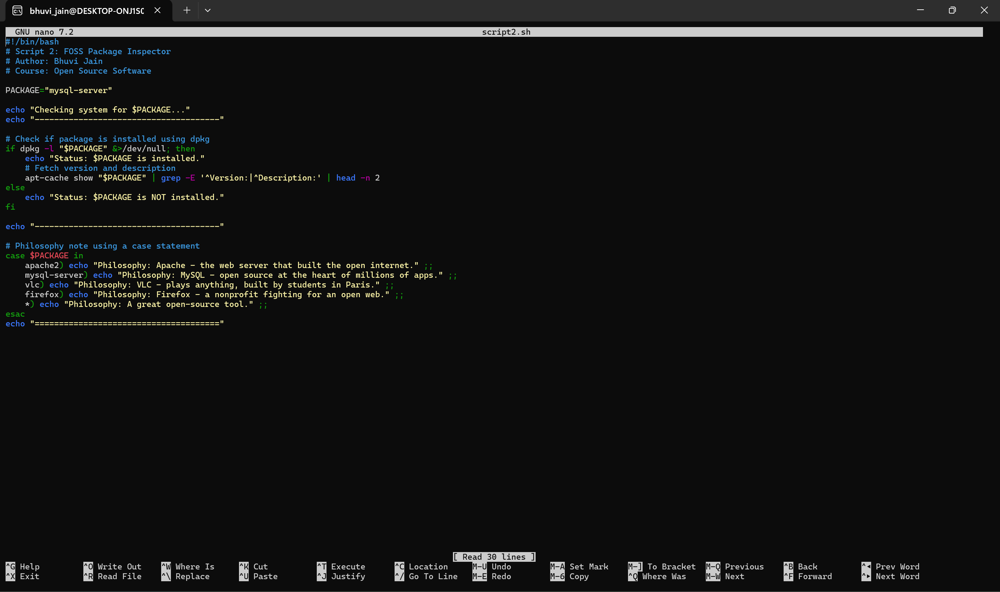

### 3. Disk and Permission Auditor (`script3.sh`)
* **Description:** Iterates through critical system directories (including `/etc/mysql`) to audit their current footprint. It extracts and displays the directory ownership, read/write/execute permissions, and total disk space used.
* **Concepts Used:** `for` loops, `awk` text processing, `ls -ld`, and `du`.
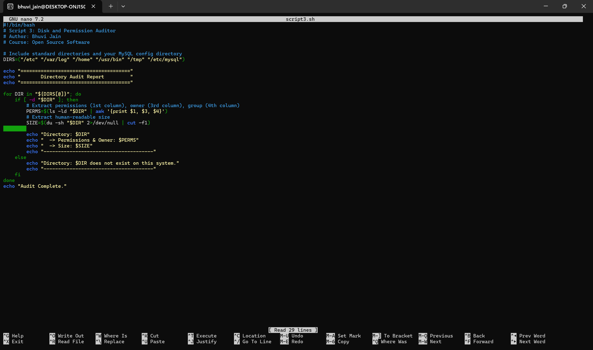
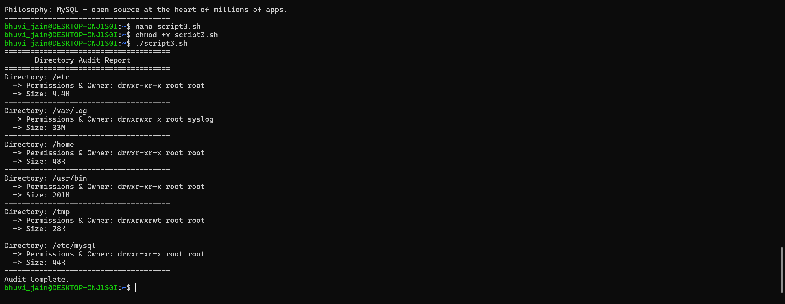

### 4. Log File Analyzer (`script4.sh`)
* **Description:** Parses a specified system log file line-by-line to count the occurrences of a specific keyword (defaults to "error"). It includes a retry mechanism for invalid files and prints the last 5 matching log entries.
* **Concepts Used:** `while-read` loops, command-line arguments (`$1`), arithmetic counters, and `grep`/`tail`.
 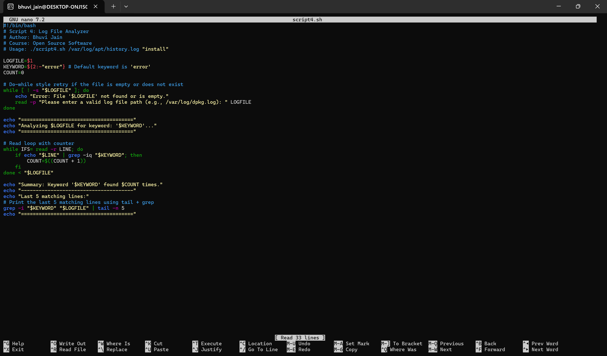
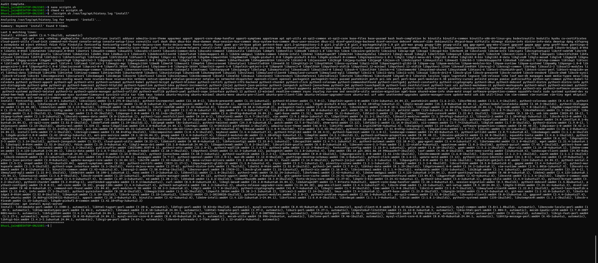

### 5. Open Source Manifesto Generator (`script5.sh`)
* **Description:** An interactive script that prompts the user for their thoughts on open-source philosophy. It concatenates their inputs into a personalized manifesto and appends the output to a dynamically generated `.txt` file.
* **Concepts Used:** Interactive `read` prompts, string concatenation, file redirection (`>`), and the `date` command.
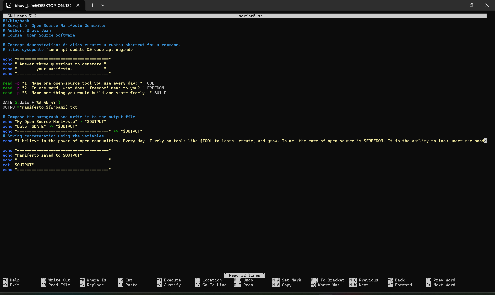
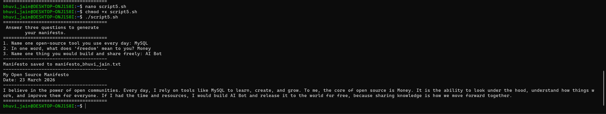
---

## 🚀 Step-by-Step Execution Instructions

To run these scripts on your local Linux machine, follow these steps:

**Step 1: Clone the repository**
```bash
git clone https://github.com/savniagrawal1701/oss-audit--24BCE10291.git
cd oss-audit-[24BCE10291]

